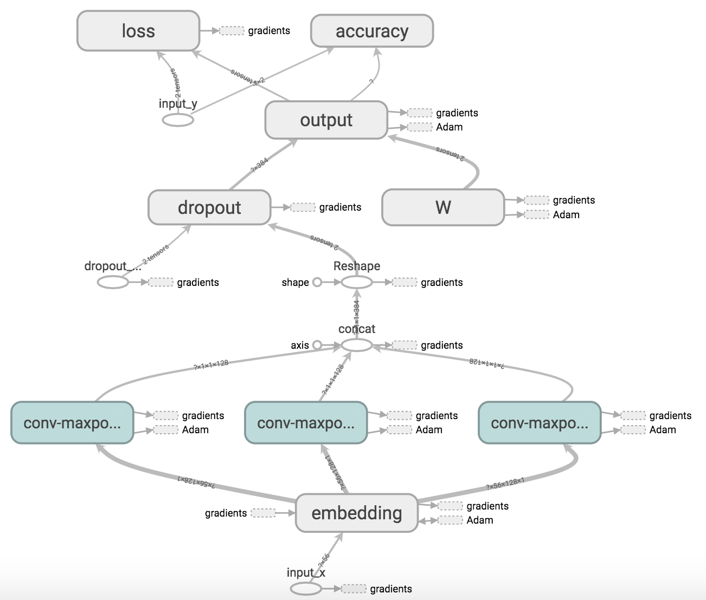
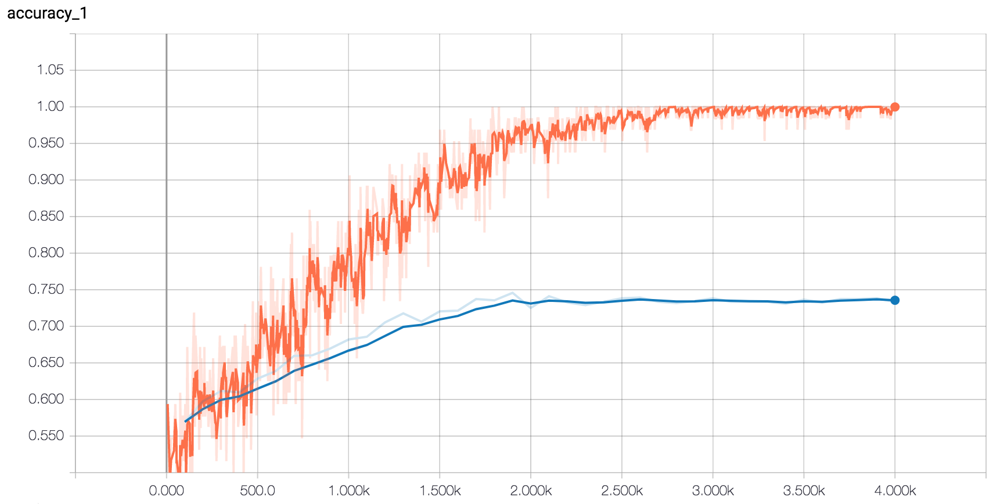
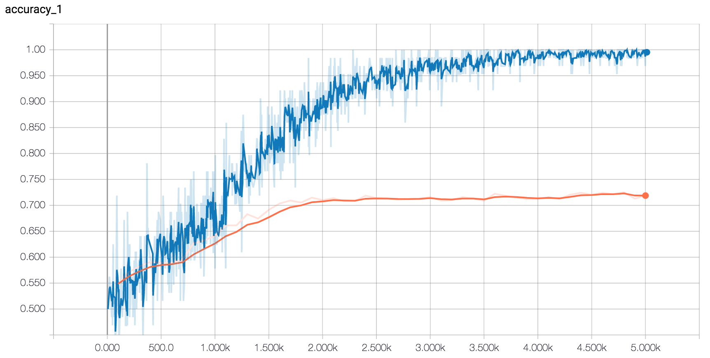
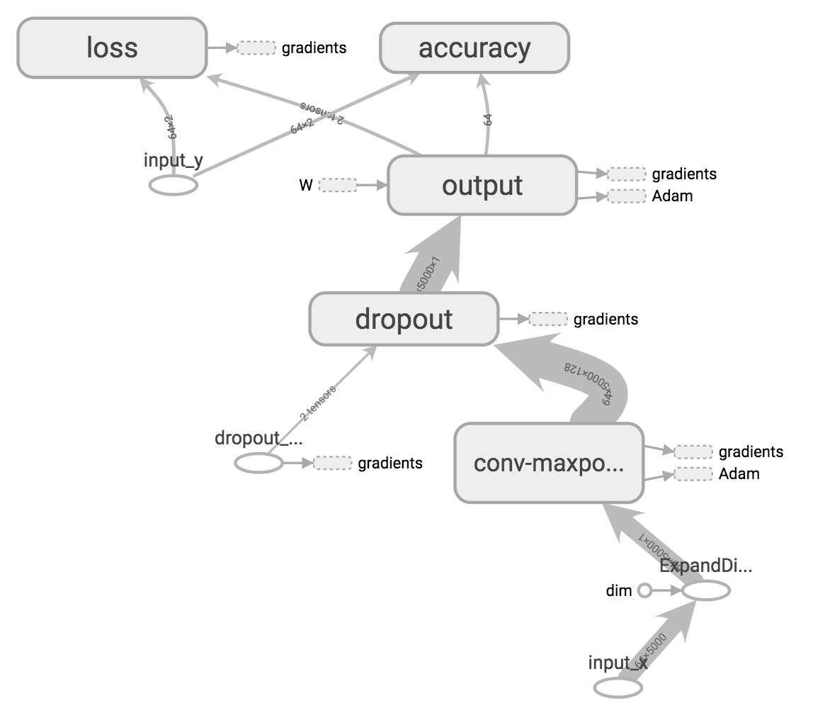
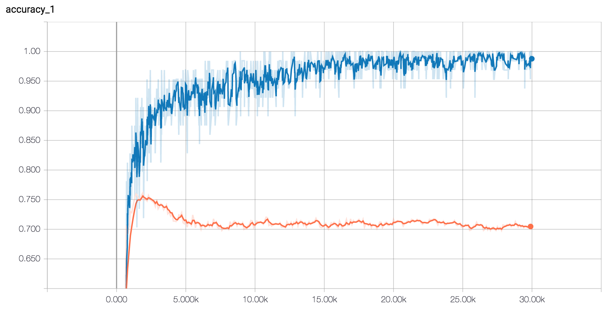

# Rotten Tomatoes Movie Reviews Classifier

## Dataset Description

The dataset used is Pang and Lee's movie review sentiment polarity dataset (`sentence polarity dataset v1.0` from [here](http://www.cs.cornell.edu/people/pabo/movie-review-data/)), which consists of 5,331 positive and 5,331 negative sentences, formed from a vocabulary size of ~20,000. For all the models, the data is shuffled and 10% of the dataset is used as the test set.

### Preprocessing

> The data preprocessing code is available in `data.py` and is identical to the code used in [Yoon Kim's paper](https://arxiv.org/pdf/1408.5882.pdf).

1. Load the data from the files inside `data/`.
2. `.strip()` every sentence.
3. Replace any characters that don't match ``/[A-Za-z0-9(),!?\'\`]/`` with a whitespace.
4. Insert a whitespace between a word and a clitic (`'ve`, `'re` etc.), if any.
5. Insert a whitespace before punctuation marks.
6. Delete any repeated whitespaces.

## Summary of Model Performance

> **Disclaimer:** The preprocessing for each of the following models is not consistent and may have affected the accuracies. Please read each model's description (below) for further details.

| **Model**                                         | **Test Accuracy** |
|---------------------------------------------------|-------------------|
| Multinomial Naive Bayes (TF-IDF Vectorized Input) | 77.58%            |
| Model v1 (CNN)                                    | 74.30%            |
| Model v1.2 (CNN w/ Pre-Trained Embeddings)        | 79.46%            |
| Model v2 (CNN on Similarity Vectors)              | 75.61%            |
| Model v3 (Graph CNN)                              | 76.17%            |

## Model v0: Baseline Models

> The code for the model & training can be found in `baseline.py` & `baseline_embeddings.py`.

In order to establish a baseline for the more complex models below, three simple models were implemented (given below with their respective test accuracies):

1. Linear SVC (TF-IDF Vectorized Input): 76.74%
2. **Multinomial Naive Bayes (TF-IDF Vectorized Input): 77.58%**
3. Linear SVC (Mean of Pre-Trained Word Embeddings): 76.27%

## Model v1: Convolutional Neural Network

> Code based on Denny Britz's TensorFlow adaptation of Kim's model, which is blogged about [here](http://www.wildml.com/2015/12/implementing-a-cnn-for-text-classification-in-tensorflow/).

### Model Description

> The code for the model can be found in `text_cnn.py`.

The model consists of an embedding layer followed by multiple parallel convolutional + max-pool layers before the outputs are combined and classified by a softmax layer.

#### Computational Graph



### Model Performance

> The code for training can be found in `v1_train.py`.


- **Embedding Dimensionality:** 128
- **Filter Sizes:** 3, 4, 5
- **Number of Filters:** 128
- **Dropout Keep Probability:** 0.5

**Maximum Test Accuracy:** 74.30%

<!--


- **Embedding Dimensionality:** 128
- **Filter Sizes:** 4
- **Number of Filters:** 128
- **Dropout Keep Probability:** 0.5

**Maximum Test Accuracy:** 74.58%
-->

<!--


- **Embedding Dimensionality:** 50
- **Filter Sizes:** 3, 4, 5
- **Number of Filters:** 10
- **Dropout Keep Probability:** 0.5

**Maximum Test Accuracy:** 72.51%
-->

## Model v1.1: CNN w/ Pre-Trained Embeddings

### Model Description

Model v1.1 is nearly identical to Model v1, except that it uses pre-trained word embeddings (Google's `word2vec`) instead of learning the embeddings from the dataset. The embeddings of 2,310 words not present in `word2vec` are randomly initialized and all embeddings are kept static during training.

The details of these pre-trained embeddings can be found [here](https://code.google.com/archive/p/word2vec/) and the actual file can be downloaded [here](https://drive.google.com/file/d/0B7XkCwpI5KDYNlNUTTlSS21pQmM/edit). The embeddings are loaded using `data.load_word2vec()`.

### Model Performance


- **Embedding Dimensionality:** 300
- **Filter Sizes:** 3, 4, 5
- **Number of Filters:** 128
- **Dropout Keep Probability:** 0.5

**Maximum Test Accuracy:** 78.99% <!-- 0.789868653 -->

This model performed better than Model v1 (~5% increase in accuracy), which suggests that learning the word embeddings from the relatively smaller movie review dataset is not ideal.

## Model v1.2: CNN w/ Fine-Tuned Pre-Trained Embeddings

Model v1.2 improves upon Model v1.1 by fine-tuning (i.e. learning) the pre-trained embeddings during training. This is done by setting `trainable=True` (or removing the argument altogether) for the embedding matrix in `text_cnn.py`.

### Model Performance


- **Embedding Dimensionality:** 300
- **Filter Sizes:** 3, 4, 5
- **Number of Filters:** 128
- **Dropout Keep Probability:** 0.5

**Maximum Test Accuracy:** 79.46% <!-- 0.794559121 -->

There is only a slight increase in accuracy, however, an interesting observation is that the model is more prone to overfitting when learning the embeddings (training accuracy is almost consistently 100% towards the end) as opposed to Model v1.1, which never *consistently* had a 100% training accuracy.

<!--

### Advantages of Tuning Pre-Trained Embeddings

> A version of these observations is also recorded in Kim's paper.

The first obvious advantage is the fact that the 2,310 words from the vocabulary which are not present in the pre-trained embeddings (and are randomly initialized) are now learned during training instead of retaining their random initial values.

In order to better understand why fine-tuning embeddings learned on a massive dataset for the task at hand is helpful, I extracted the 10 most similar words (using cosine similarity) for the following words from the learned embeddings of both models. The code can be found in `word_similarity.py`:

**`good`:**

```
v1.1.0: ['good', 'great', 'bad', 'terrific', 'decent', 'nice', 'excellent', 'fantastic', 'better', 'solid']
v1.2: ['good', 'terrific', 'decent', 'great', 'nice', 'solid', 'fantastic', 'excellent', 'better', 'wonderful']
```

**`bad`:**

```
v1.1.0: ['bad', 'good', 'terrible', 'horrible', 'lousy', 'crummy', 'horrid', 'awful', 'dreadful', 'nasty']
v1.2: ['bad', 'horrible', 'terrible', 'lousy', 'awful', 'nasty', 'crummy', 'rotten', 'crappy', 'scary']
```

In Model v1.1 (default pre-trained embeddings), "bad" & "good" are considered similar words perhaps due to their syntactical purpose, however, they mean completely different things for the task at hand and this is reflected in the embeddings learned in Model v1.2.

-->

## Model v2: CNN on Similarity Vectors

### Model Description

> The code for the model can be found in `text_similarity_cnn.py`.

Model v2 uses the pre-trained word embeddings (with fine-tuning) as in Model v1.2, however, the input given to the network is not the `56 x 300` embedded matrix but rather a `56 x 18758` matrix where each word is represented by a vector that contains the cosine similarity of the word to every other word in the vocabulary. These similarity vectors are re-calculated at every iteration (using [this method](https://github.com/tensorflow/tensorflow/blob/master/tensorflow/examples/tutorials/word2vec/word2vec_basic.py#L192)) as the embeddings are fine-tuned during training. The overall model architecture & hyperparameters involved remain the same as Model v1.

This model has a lot of trainable parameters and is probably **not practical** but helps represent the words in a graph-like structure using slices of the graph's similarity matrix while retaining the 2D grid needed for convolution operations.

### Model Performance

> The code for training can be found in `v2_train.py`.


- **Embedding Dimensionality:** 300 (Google's `word2vec`)
- **Filter Sizes:** 3, 4, 5
- **Number of Filters:** 128
- **Dropout Keep Probability:** 0.5

**Maximum Test Accuracy:** 75.61% <!-- 0.756098 -->

## Model v3: Graph CNN

### Model Description

> The code for the model can be found in `text_gcnn.py`.

Model v3 is a graph convolutional neural network based on the [paper](https://arxiv.org/abs/1606.09375) & [code](https://github.com/mdeff/cnn_graph) by Michael Defferrard, Xavier Bresson & Pierre Vandergheynst. The graph is a 16-NN graph constructed from the pre-trained word embeddings of the 5,000 most frequent words in the vocabulary and each sentence (i.e. pattern) is represented by its TF-IDF vector.

#### Computational Graph



### Model Performance

> The code for training can be found in `v3_train.py`.



- **Embedding Dimensionality:** 300 (Google's `word2vec`)
- **No. of Nearest Neighbors:** 16
- **Coarsening Levels:** 0
- **Chebyshev Polynomial Order(s):** 5
- **No. of Output Features per Vertex:** 32
- **Pooling Size(s):** 1 (no pooling)
- **Dropout Keep Probability:** 0.5

**Maximum Test Accuracy:** 76.17% <!-- 0.761726081 -->

---

## References

- [Convolutional Neural Networks for Sentence Classification - Yoon Kim](https://arxiv.org/abs/1408.5882)
    - https://github.com/yoonkim/CNN_sentence
- [A Sensitivity Analysis of (and Practitioners' Guide to) Convolutional Neural Networks for Sentence Classification - Ye Zhang & Bryon C. Wallace](https://arxiv.org/abs/1510.03820)
- [Implementing a CNN for Text Classification - Denny Britz](http://www.wildml.com/2015/12/implementing-a-cnn-for-text-classification-in-tensorflow/)
    - https://github.com/dennybritz/cnn-text-classification-tf
- [Convolutional Neural Networks on Graphs with Fast Localized Spectral Filtering - Michael Defferrard, Xavier Bresson & Pierre Vandergheynst](https://arxiv.org/abs/1606.09375)
    - https://github.com/mdeff/cnn_graph
