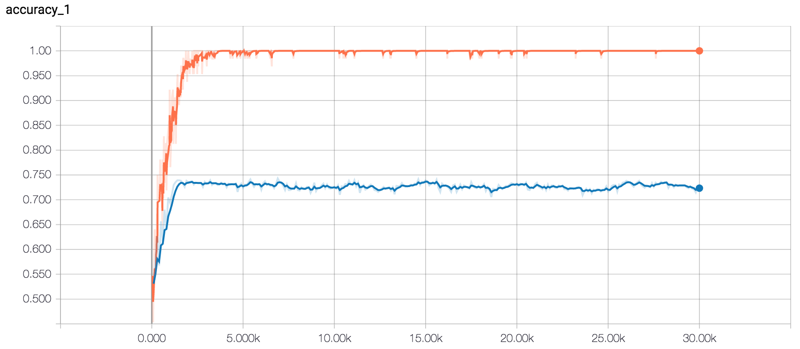
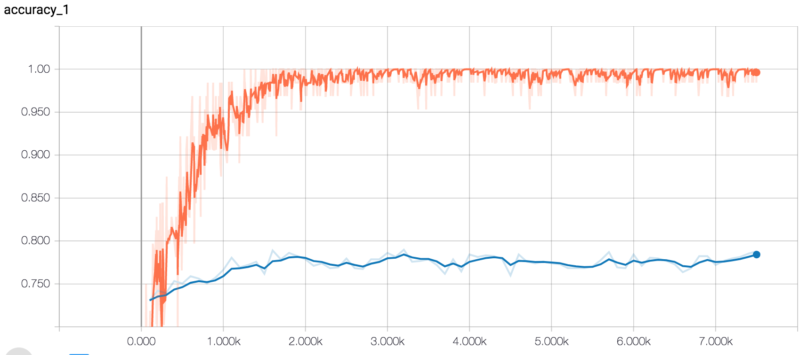

# CNN for Rotten Tomatoes Movie Reviews

> This model aims to classify movie reviews from Rotten Tomatoes as either positive or negative.

## Dataset Description

The dataset used is Pang and Lee's movie review dataset (`sentence polarity dataset v1.0` from [here](http://www.cs.cornell.edu/people/pabo/movie-review-data/)), which consists of 5,331 positive and 5,331 negative sentences, formed from a vocabulary size of ~20,000.

### Preprocessing

> The data preprocessing code is available in `data.py` and is identical to the code used in [Yoon Kim's paper](https://arxiv.org/pdf/1408.5882.pdf).

1. Load the data from the files inside `data/`.
2. `.strip()` every sentence.
3. Replace any characters that don't match ``[A-Za-z0-9(),!?\'\`]`` with a whitespace.
4. Insert a whitespace between a word and a verb's contracted form (`'ve`, `'re` etc.).
5. Insert a whitespace before punctuation marks.
6. Delete any repeated whitespaces.

# Model v1

> Code based on Denny Britz's TensorFlow adaptation of Kim's model, which is blogged about [here](http://www.wildml.com/2015/12/implementing-a-cnn-for-text-classification-in-tensorflow/).

## Data Preparation

The sentences from the dataset are fed into TensorFlow's `VocabularyProcessor`, which builds a vocabulary index and maps each word to an integer between 0 and 18,757 (vocabulary size). Each sentence is padded with special padding tokens `<UNK>` (index of 0 in vocabulary) to fit the maximum sentence size of 56 words.

The data is shuffled and 10% of the dataset is used as the test set.

## Model Description

> The code for the model can be found in `v1_model.py`.

The model consists of an embedding layer followed by multiple convolutional + max-pool layers before the output is classified using a softmax layer.

### Hyperparameters

- `embedding_size`: The dimensionality of the embeddings (lower-dimensional vector representations of the vocabulary indices).
- `filter_sizes`: The number of words the convolutional filters should cover. For example, `[3, 4, 5]` will create filters that slide over 3, 4 and 5 words respectively.
- `num_filters`: The number of filters per filter size.
- `l2_reg_lambda`: L2 regularization term. Default is 0.
- `dropout_keep_prob`: Probability of keeping a neuron in the dropout layer.

> **NOTE:** Does not include training parameters like learning rate, batch size etc.

## Model Performance

> The code for training can be found in `v1_train.py`.

- **Embedding Dimensionality:** 128
- **Filter Sizes:** 3, 4, 5
- **Number of Filters:** 128
- **Dropout Keep Probability:** 0.5
- **L2:** 0.0

**Maximum Test Accuracy:** 74.30%

## Crude Regularization Tuning

Crude hyperparameter tuning was performed for the regularization terms to check for any drastic changes in model performance. The results are documented [here](v1_Regularization_Tuning.md).

# Model v2

## Data Preparation

The dataset is prepared in the exact same way as Model v1 (above).

## Model Description

> The code for the model can be found in `v2_model.py`.

This model is almost identical to Model v1, except that it uses pre-trained word embeddings (Google's `word2vec`, trained on a corpus of ~100 billion words from Google News) instead of learning the embeddings from the dataset. The embeddings of the 2,310 words not present in `word2vec` are initialized randomly and all embeddings are kept static during training.

The details of these pre-trained embeddings can be found [here](https://code.google.com/archive/p/word2vec/) and the actual file can be downloaded [here](https://drive.google.com/file/d/0B7XkCwpI5KDYNlNUTTlSS21pQmM/edit). The embeddings are processed in `v2_train.py`.

## Model Performance

> The code for training can be found in `v2_train.py`.

- **Embedding Dimensionality:** 128
- **Filter Sizes:** 3, 4, 5
- **Number of Filters:** 128
- **Dropout Keep Probability:** 0.5
- **L2:** 0.0

**Maximum Test Accuracy:** 79.00%

This model performed better than Model v1 (~5% increase in accuracy), which suggests that learning the word embeddings from the relatively smaller movie review dataset is not ideal.

# References

- [Convolutional Neural Networks for Sentence Classification - Yoon Kim](https://arxiv.org/abs/1408.5882)
- https://github.com/yoonkim/CNN_sentence
- [A Sensitivity Analysis of (and Practitioners' Guide to) Convolutional Neural Networks for Sentence Classification - Ye Zhang & Bryon C. Wallace](https://arxiv.org/abs/1510.03820)
- [Implementing a CNN for Text Classification - Denny Britz](http://www.wildml.com/2015/12/implementing-a-cnn-for-text-classification-in-tensorflow/)
- https://github.com/dennybritz/cnn-text-classification-tf
