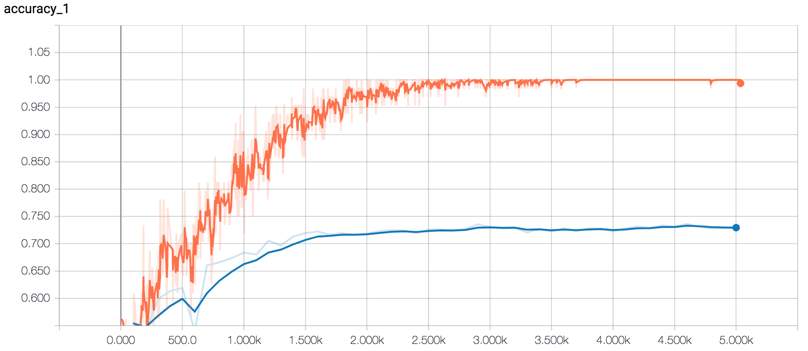

# Model v1 - Crude Regularization Tuning

Below are the different training runs of the model with different hyperparameter values for regularization. In most of the runs, the training was stopped before the full 200 epochs but once convergence was somewhat achieved (checked visually using TensorBoard) due to time constraints. The full list of runs can be found in `v1_runs.txt`.

> **NOTE:** The hyperparameter tuning performed below is very crude and does not use cross-validation or multiple experiments (there is some amount of variance with multiple training runs of the same model). It was just done to make sure there were no drastic changes in model performance with different values for regularization.

## Initial Run

Dropout Keep Probability: 0.5, L2: 0.0

**Maximum Test Accuracy:** 75.80%

Since test accuracy is significantly below training accuracy, it suggests that the model is overfitting the training data. This could be because the dataset is too small, regularization is too weak or there are too many model parameters.

## Dropout

### Dropout Keep Probability: 0.1

**Maximum Test Accuracy:** 74.67%

### Dropout Keep Probability: 0.3

**Maximum Test Accuracy:** 73.08%.

### Dropout Keep Probability: 0.4

**Maximum Test Accuracy:** 74.11%.

### Dropout Keep Probability: 0.5

**Maximum Test Accuracy:** 75.80%.

### Dropout Keep Probability: 0.6

**Maximum Test Accuracy:** 74.77%

### Dropout Keep Probability: 0.9

**Maximum Test Accuracy:** 72.70%

## L2 Regularization

After finding the dropout rate to be somewhat optimal at 0.5, I experimented with the L2 regularization term.

### L2: 0.95

**Maximum Test Accuracy:** 75.61%

### L2: 0.50

**Maximum Test Accuracy:** 73.64%

### L2: 0.15

**Maximum Test Accuracy:** 75.52%
